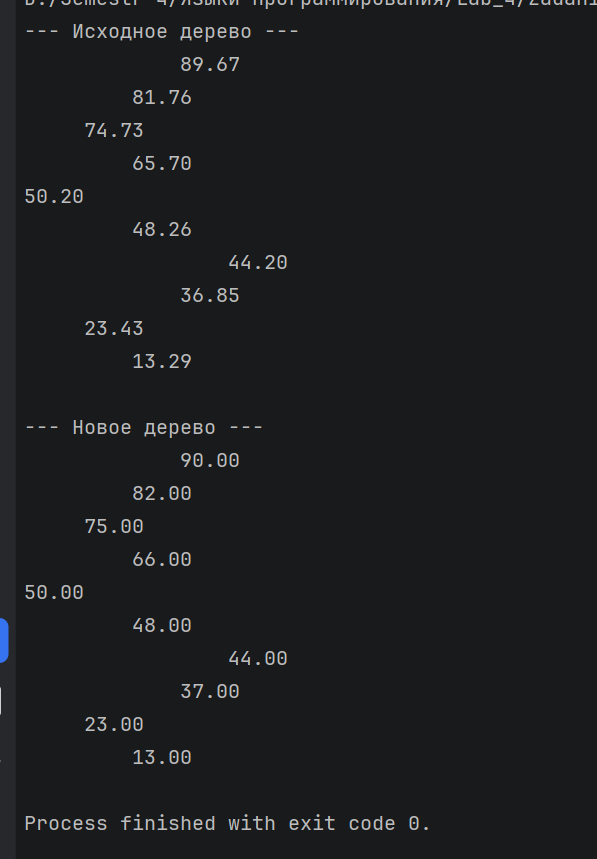
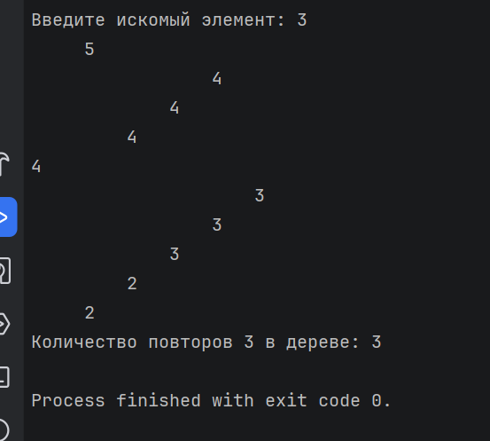

# Задание 1. Решить задачу на построение нового дерева по заданному (map)

## Задача 8

### Текст задачи

Дерево содержит вещественные числа. Округлить каждый элемент.

### Алгоритм решения

Входные данные:

n (целое число) — количество узлов, которые необходимо создать в дереве.

originalTree — бинарное дерево поиска, заполненное случайными вещественными числами.

Выходные данные:

roundedTree (структура данных) — новое бинарное дерево той же структуры, но с округленными значениями.

Логика работы:

Создание нового типа:

Создан рекурсивный тип данных.

Состояния: Empty (пустой узел) и Node (узел, содержащий значение и ссылки на два дочерних узла).

Механизм вставки (insert):

Реализована логика Бинарного Дерева Поиска.

При добавлении нового значения оно сравнивается с текущим узлом: если значение меньше — оно направляется в левое поддерево, если больше или равно — в правое.

Генерация дерева (generateRandomTree):

Используется рекурсивая функция с аккумулятором. Программа n раз генерирует новое число с помощю rnd.NextDouble() * 100.0 и вызывает функцию insert.

Когда счетчик n достигает нуля, возвращается накопленное дерево. - базовый случай

Округление через Map (treeMap):

Используется функция, реализующая работу функции Map.

Обход: Программа посещает каждый узел и применяет к его значению функцию Math.Round.

Вместо модификации существующего дерева создается его копия с новыми значениями.

Вывод дерева (printTree):

Используется центральный обход в порядке (Право -> Узел -> Лево).

Параметр indent (отступ) и prefix (элемент ветки) позволяют визуализировать дерево в консоли, отображая его с боку.

Завершение:

Программа последовательно выводит исходное бинарное дерево и результат округления.

### Тестирование

# Задание 2. Решить задачу на получение заданного результата для указанного дерева (fold)

## Задача 8

### Текст задачи

Сколько раз входит заданный элемент в дерево?

### Алгоритм решения

Входные данные:

n (целое число) — количество узлов, которые необходимо создать в дереве.

Tree — бинарное дерево поиска, заполненное случайными целыми числами.

target (целое число) — искомый элемент, количество вхождений которого нужно подсчитать.

Выходные данные:

count (целое число) — итоговое количество узлов в дереве, значения которых равны target.

Логика работы:

Создан рекурсивный тип данных.

Состояния: Empty (пустой узел) и Node (узел, содержащий значение и ссылки на два дочерних узла).

Механизм вставки (insert):

Реализована логика Бинарного Дерева Поиска.

При добавлении нового значения оно сравнивается с текущим узлом: если значение меньше — оно направляется в левое поддерево, если больше или равно — в правое.

Генерация дерева (generateRandomTree):

Используется рекурсивая функция с аккумулятором. Программа n раз генерирует случайное число в диапазоне от 1 до 5 (для повышения вероятности повторов) и вставляет их в дерево с помощью insert.

Свёртка дерева (treeFold):

Применяется функция fold для проверки данных дерева в одно значение.

Функция принимает начальный аккумулятор (acc = 0). Используется центральный обход : сначала сворачивается левое поддерево, затем обрабатывается текущий узел, после чего результат передается в правое поддерево.

Подсчет вхождений:

В treeFold передается выражение, которое сравнивает значение каждого узла с target. Если значения совпадают, счетчик увеличивается на 1.

Завершение:

Дерево выводится в консоли с помощью функции printTree.

Итоговое количество найденных элементов выводится на экран.

### Тестирование
